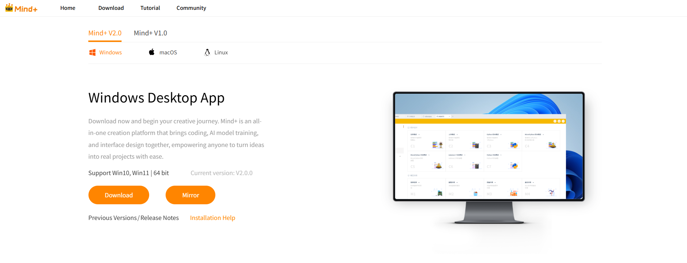
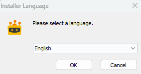
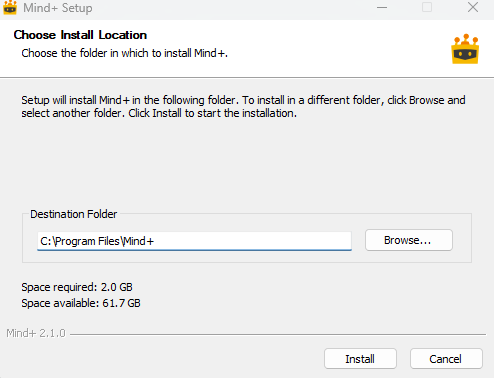
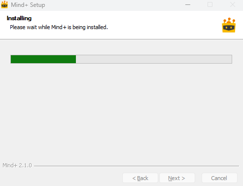
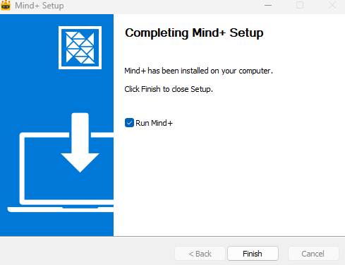

## 系统要求
- **操作系统：** 64位 Windows 10 及以上版本
- **内存（RAM）：** 4GB 及以上

> 以上为推荐最低配置，配置越高Mind+运行越流畅，编译速度越快，体验越好。

> 如不满足此系统要求，可继续使用Mind+ V1版本.

---

## 安装步骤

### 步骤1：下载软件

1. 访问Mind+官网：[**http://mindplus.cc**](http://mindplus.cc "http://mindplus.cc")

2. 点击 **立即下载** 按钮
   

3. 根据您的操作系统选择对应版本进行下载
   

### 步骤2：安装软件

!!! note "安装提示"
    如果电脑上已经安装了Mind+，新版本会自动覆盖旧版本，无需先卸载。

    如果想两个版本共存，请下载[Mind+ V1免安装版](https://mindplus.dfrobot.com.cn/PreviousVersions)。

1.**选择安装语言**

- 双击安装包，选择安装语言，点击 **OK** 继续

    

2.**完成安装**

-  按照安装向导提示进行安装，等待进度条完成即可

    
    

3.**安装成功**

- 安装成功后，点击 **完成** 关闭安装向

    

!!! warning "注意"
    如果安装过程中遇到问题，请参考下方 **常见问题** 部分的解决方案。

---

## 常见问题

持续更新中...
