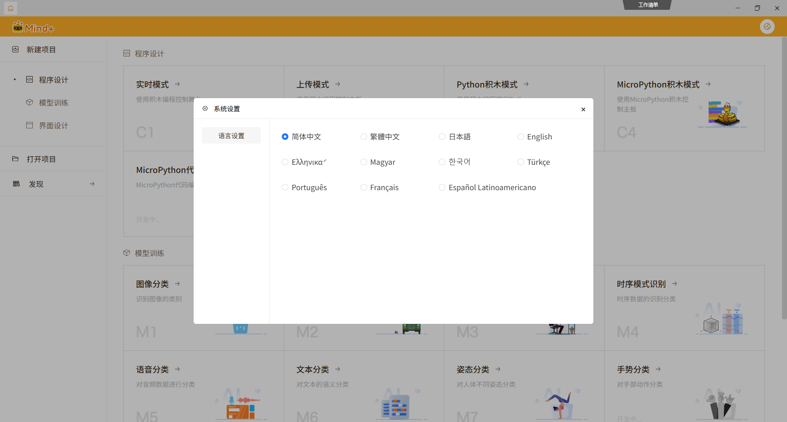

## System Requirements
- **Operating System:** 64-bit Windows 10 and above
- **Memory (RAM):** 4GB and above

> The above are the recommended minimum configurations. Higher configurations will make Mind+ run more smoothly, compile faster, and provide a better experience.

> If these system requirements are not met, you can continue to use Mind+ V1.

---

## Installation Steps

### Step 1: Download Software

1. Visit the Mind+ official website: [**http://mindplus.cc**](http://mindplus.cc "http://mindplus.cc")

2. Click the **Download Now** button
   

3. Select the corresponding version for your operating system to download
   

### Step 2: Install Software

!!! note "Installation Note"
    If Mind+ is already installed on your computer, the new version will automatically overwrite the old version without needing to uninstall first.

    If you want both versions to coexist, please download the [Mind+ V1 portable version](https://mindplus.dfrobot.com/PreviousVersions).

1.**Select Installation Language**

- Double-click the installation package, select the installation language, and click **OK** to continue

    

2.**Complete Installation**

-  Follow the installation wizard prompts to install, and wait for the progress bar to complete

    
    

3.**Installation Successful**

- After successful installation, click **Finish** to close the installation wizard

    

4.**Run Mind+**

- click **Finsh** to run Mind+

### Step 3: Language Settings

If the Mind+ interface is not in English when you first open it, you can easily change the language settings:

1.**Open Settings**

   - Click the **Settings**  in the top-right corner of the Mind+ interface

2.**Change Language**

   - In the Settings menu, look for **Language** or **语言设置** option
   - Select **English** from the dropdown menu
   - The interface will automatically switch to English

3.**Restart if Needed**

   - If the language doesn't change immediately, restart Mind+ for the changes to take effect

!!! tip "Language Tip"
    Mind+ supports multiple languages including English, Chinese, and others. You can switch between languages at any time through the Settings menu.

!!! warning "Note"
    If you encounter problems during installation, please refer to the **Common Issues** section below for solutions.

---

## Common Issues

Continuously updating...

